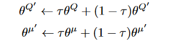
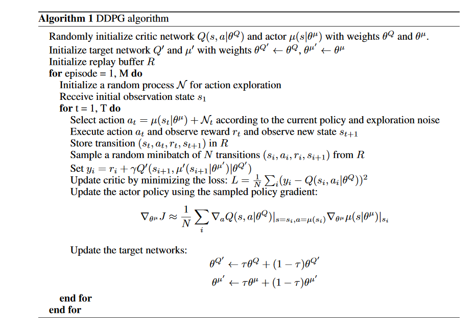
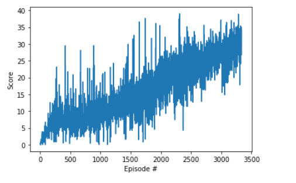

## Project 2: Continuous Control

For this project, we are to train a double-jointed arm to maintain its position at the target location for as many time steps as possible. A reward of +0.1 is provided for each step that the agent's hand is in the goal location. 

The observation space consists of 33 variables corresponding to position, rotation, velocity, and angular velocities of the arm. Each action is a vector with four numbers, corresponding to torque applicable to two joints. Every entry in the action vector should be a number between -1 and 1.

This report focus on single agent, the task is episodic, and the agent has to get an average score of +30 over 100 consecutive episodes

## Learning algorithm

In this project, DDPG which is kind of actor critic algorithm was used. 

### 1. Fixed Target
There are two target networks in this implementation, one for actor and one for critic. The purpose of target network is to have a stable target during training to enhance the stability. 

During training, the target values are non stationary. This is particular problematic for deep Q network. Within each training iteration, we update model parameters to move closer to the target. But this update will impact other estimation in a deep network, the surrounding states will be impacted.

using target network, enchance the stability during training.

### 2. Soft updates

The weights for both actor/critic target networks are updated by having them slowly tracking the learned network as below, such that the target values are constrained to change slowly which greatly improve the stability.

### 3. Experience replay
In order to break correlation between experience when we sample the data for training. Replay buffer is used, which is a finite sized cache, used to store samples. When actor or critic needs data for training, a minbatch was sampled randomly from this buffer to break the correlations between samples.

### 4. OU Noise
An Ornstein-Uhlenbeck process was used to construct an exploration policy as follows, where We constructed an exploration policy μ′ by adding noise sampled froma noise process N to our actor policy

### 5. DDPG algorithm

### 6. hyperparameters

| parameter | value |
| --------- | ----- |
| state size | 33|
| action size | 4|
| buffer size | 1000000|
| gamma (discount factor)  | 0.99|
| tau | 0.001|
| actor learning rate | 0.0002|
| critic learning rate | 0.0002|
| number of agents | 1 |
| OU Noise theta | 0.15 |
| OU Noise sigma | 0.2 |

### 7. implementation 

The implementation is following ddpg-pendulum code from https://github.com/udacity/deep-reinforcement-learning, with some modification and tuning of hyperparameters.

* The buffer size of 1000000 wass used, which is sufficiently big but not causing memory issues.
* Only single agent was used, the training took a lot of steps to reach 30.0. Probably using 20 agents will be able to improve the training time.
* initially following the ddpg-pendulum implementation, the learning rate for critic was set to 1e-3 and actor was 1e-4. But the system was not able to learn and stay close to a score of 1, and scores vary widely. Probably the learning rate was too high for the critic. So the learning rate for critic and actor was set to be the same,
and was set to 0.0004, but was still not doing well. eventually the learning rate was set to be 0.0002 after some trial and error.
* Initially the system was not learning, so a gradient clipping was applied to the critic parameters in the learning step before the optimizer step as follows

        torch.nn.utils.clip_grad_norm_(self.critic_local.parameters(), 1)
        self.critic_optimizer.step()
* For the OU Noise process, the theta = 0.15 and sigma = 0.2 , which is just using the same parameters from the ddpg-pendulum implementation. which seems to work fine.
* for the soft update step, tau was picked to be 0.001, i.e. during each update step, only 0.001 of the local network weights are mixed with the target network weights.
* the actor network has following configuration, 
         <ul>
         <li>input layer: input x 128 
         <li>relu
         <li>hidden layer: 128 x 128
         <li>relu
         <li>output layer: 128 x 4
         <li>tanh
        </ul>
* The critic network has the following configuration
        <ul>
        <li>input layer: input x 128
        <li>relu
        <li>hidden layer: 128  + action_size x 128
        <li>relu
        <li>output layer: 128 x 1
        </ul>
        
## Plot of Rewards

## Future Work
1. Current implementation only work with single agent, will extend the agent to work with multiple (20) agents in the provided environment
2. It seems it is kind of hard to train DDPG, seems to be sensitive to actor/critic learning rate and took long time to reach the score of 30, will like to explore other algorithm like PPO, A3C and compare their performance.

### reference
Continuous Control with Deep reinforcement Learning, Timothy P.Lillicrap,Jonathan J.Hunt, https://arxiv.org/pdf/1509.02971.pdf
